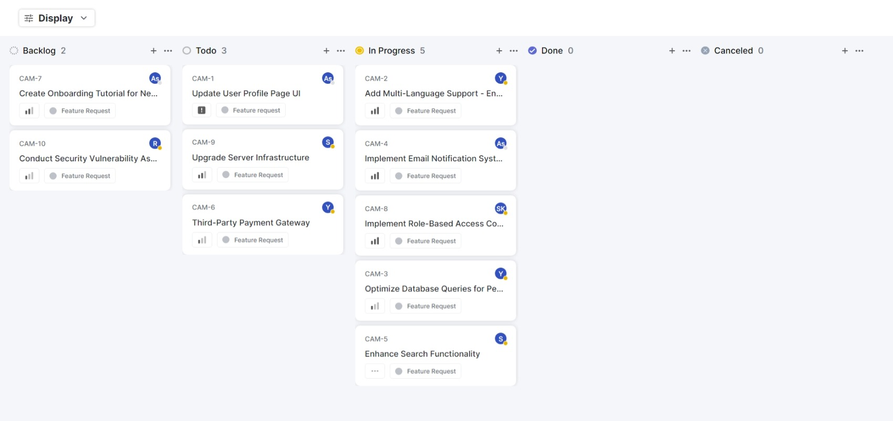
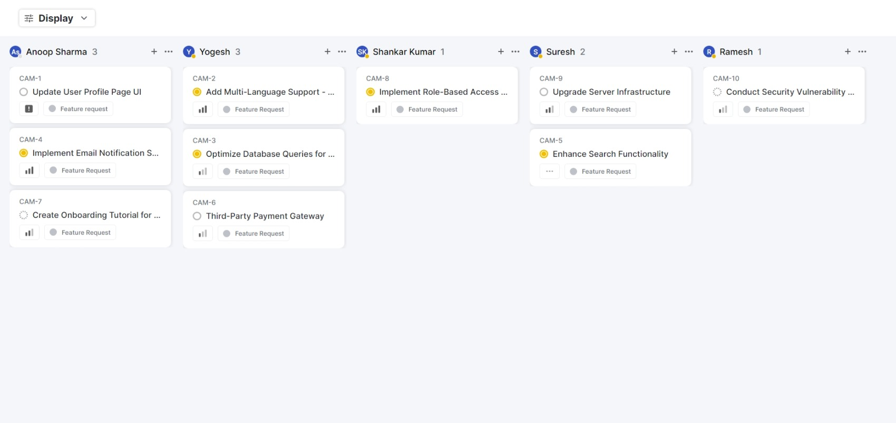
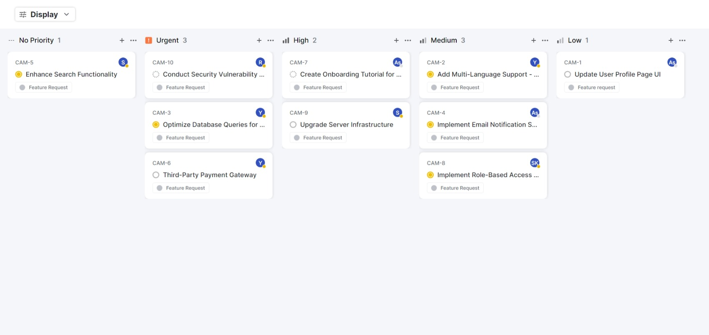
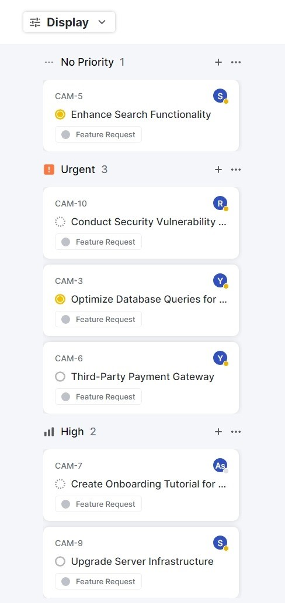

# Kanban Board Application

## Table of Contents

- [Project Overview](#project-overview)
- [Setup Instructions](#setup-instructions)
- [Features](#features)
- [Usage Guidelines](#usage-guidelines)
- [API Integration](#api-integration)
- [Components](#components)
- [State Management](#state-management)
- [Responsive Design](#responsive-design)
- [Saving User View State](#saving-user-view-state)
- [Credits](#credits)

## Project Overview

This project is a Kanban Board application built using React and TypeScript.

Key features of this Kanban Board include:

- Dynamic grouping of tickets based on status, user, and priority
- Sorting options for tickets based on priority and title
- Responsive design
- Persistence of user view state across page reloads

## Setup Instructions

1. Clone the repository:

`git clone https://github.com/yourusername/kanban-board.git cd kanban-board`

2. Install dependencies:

`npm install`

3. Start the development server:

`npm start`

## Features

### Grouping Options

The Kanban board offers three ways to group tickets:

1. By Status: Arrange tickets based on their current status
2. By User: Display tickets assigned to specific users
3. By Priority: Group tickets based on their priority level

Users can select their preferred grouping option using the "display" button.

### Sorting Options

Tickets can be sorted in two ways:

1. By Priority: Arrange tickets in descending order of priority
2. By Title: Sort tickets in ascending order based on their title

These sorting options are available alongside the grouping options.

### UI Design (Showcasing Grouping)

**Grouping By Status:**

**Grouping By User:**

**Grouping By Priority:**

**Mobile View:**

### Card Design

The application uses a card-based design for displaying tickets. Each card represents a task and contains essential information such as ticket ID, title, priority, status, and assigned user.

### Responsive Design

The Kanban board is built to be responsive, ensuring it looks good and functions properly on various screen sizes and devices.

### Saving User View State

The application persists the user's view state even after page reloads, allowing users to resume their work exactly where they left off.

## Usage Guidelines

1. Navigate to the Kanban Board application in your web browser.
2. Select your preferred grouping option using the "display" button.
3. Choose either Priority or Title sorting based on your preference.
4. Hover on a card to view complete information about the task.

## API Integration

This application interacts with the QuickSell API at https://api.quicksell.co/v1/internal/frontend-assignment. The API provides the necessary data for displaying and managing tickets.

## Components

The project is organized into several components:

- App.tsx: Main entry point of the application
- Card/: Component for individual cards
- Column/: Component for each column layout
- Grid/: Component for all the columns to display
- Navbar/: Component for display and sorting options
- UserProfile/: Component for user profile icon

Each component is designed to be reusable and follows React best practices for component composition.

## State Management

The application uses React's useState hook for managing the application state, including the selected grouping and sorting options, as well as the filtered and sorted ticket data.

## Responsive Design

The Kanban board is built using CSS flexbox and grid layouts to ensure responsiveness across different screen sizes. Media queries are used to adjust the layout for mobile devices.

## Saving User View State

The application uses localStorage to persist the user's view state. This allows user to store their group and order filters even after closing and reopening the browser.

## Credits

It is build by Saiyam Jain from IIT (BHU), Varanasi, uisng Create-React-App and Typescript. It is a Quick Sell Frontend Assignment. It is a simple Kanban Board Application, frontend UI.
